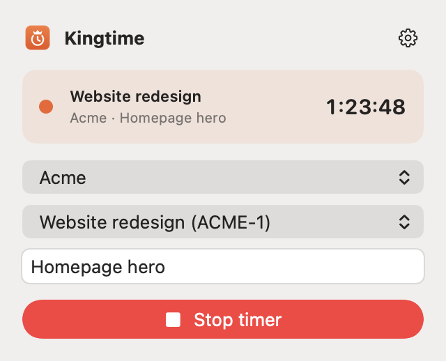

<p align="center">
  
</p>

<h1 align="center">Kingtime for Mac</h1>

<p align="center">
  A menu bar timer for <a href="https://kingtime.nl">Kingtime</a>, the open-source time tracker for freelancers.
  Pick a client and a project, press play, and the running time sits in your menu bar.
</p>

<p align="center">
  
</p>

| | |
| --- | --- |
| **Sign in once** | With your Kingtime email and password (and your two-factor code, if you use one). The app gets a personal API token that lives in your keychain and shows up under Settings › API tokens, where you can revoke it. |
| **Client, project, play** | Choose a client and a project, add a note if you like, press play. Stopping and starting again on the same project continues today's entry instead of scattering the day over many small ones. |
| **In the menu bar** | The elapsed time is shown next to the icon. Timers started on the web or through the MCP server show up here too. |
| **Idle detection** | After 15 minutes without a key or mouse event (sleep counts), the moment you are back the app asks: deduct that time from the entry, deduct it and stop the timer, or keep it. |
| **Updates itself** | Sparkle checks for a new version every six hours, downloads it in the background and installs it when you quit. |

## Install

1. Download the newest `Kingtime-x.y.z.dmg` from [kingtime.nl/download/mac](https://kingtime.nl/download/mac) (or the [releases](../../../releases), tagged `mac-vX.Y.Z`).
2. Open it and drag **Kingtime** into **Applications**. The app is signed with a Developer ID and notarised by Apple, so it opens with a plain double-click.
3. Kingtime has no dock icon: look for the crown clock in the menu bar. Turn on **Launch at login** in its gear menu if you want it around every day.

Requires macOS 14 Sonoma or later. Universal binary (Apple silicon and Intel).

## Building

The app lives in `mac/` of the Kingtime repository; run everything below from that directory.

```bash
brew install xcodegen
xcodegen generate
open Kingtime.xcodeproj
```

Or from the terminal:

```bash
xcodebuild -project Kingtime.xcodeproj -scheme Kingtime -configuration Debug \
    -derivedDataPath build -destination 'platform=macOS' build CODE_SIGN_IDENTITY="Apple Development"
```

To talk to a local Kingtime instead of kingtime.nl:

```bash
defaults write nl.kingtime.mac serverURL http://kingtime.test
```

`KINGTIME_SNAPSHOT=/tmp/panel.png build/Build/Products/Debug/Kingtime.app/Contents/MacOS/Kingtime` renders the panel to a PNG and quits (add `KINGTIME_APPEARANCE=light` or `dark`, `KINGTIME_SIGNED_OUT=1` for the sign-in form, `KINGTIME_DEMO=1` for a made-up running timer without a token or a server), which is how the screenshots in this README and on kingtime.nl are made.

## Releasing

```bash
export APPLE_API_KEY=~/.appstoreconnect/private_keys/AuthKey_XXXXXXXXXX.p8
export APPLE_API_KEY_ID=XXXXXXXXXX
export APPLE_API_ISSUER=xxxxxxxx-xxxx-xxxx-xxxx-xxxxxxxxxxxx
export SPARKLE_BIN=~/.sparkle/bin        # bin/ of the Sparkle release download

scripts/release.sh 1.1.0                 # draft release on GitHub
scripts/release.sh 1.1.0 --live          # published straight away
```

The script bumps the version in `project.yml`, builds a universal Release build, signs the app and Sparkle's helpers with the Developer ID certificate, notarises and staples the app, wraps it in a disk image (notarised and stapled as well), signs the update zip with the EdDSA key in the keychain (account `kingtime`, made with Sparkle's `generate_keys`), adds the release to `appcast.xml`, commits, tags `mac-vX.Y.Z` and creates the GitHub release with the `.dmg` and the `.zip` attached. The commit only touches `mac/`, which the production workflow ignores, so a Mac release does not redeploy the website.

Installed copies read the appcast through `https://kingtime.nl/download/appcast.xml`, which redirects to `mac/appcast.xml` on the `master` branch. So a release only reaches them once that commit is pushed, which the script does.

## How it talks to Kingtime

Everything goes through the desktop API of the Kingtime web app (`/api/desktop/*`): sign in for a token, one call for the state (user, projects, running timer), start, stop, and deduct idle time. See `app/Domain/Desktop` at the root of this repository.
